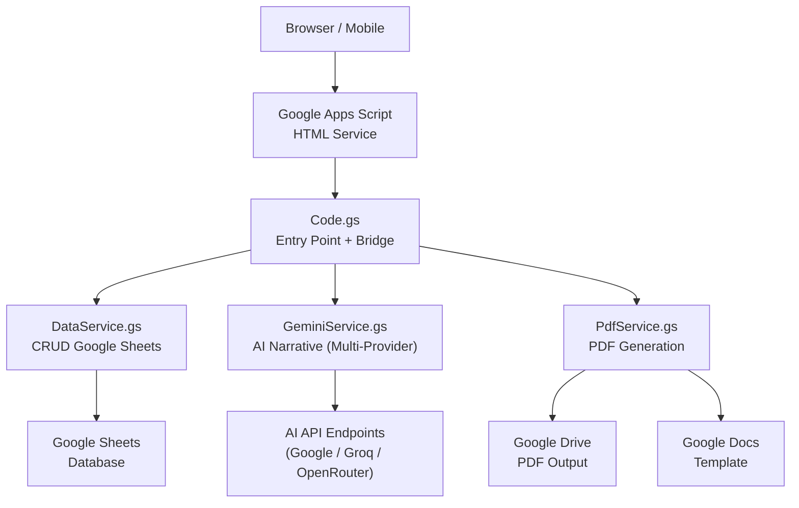
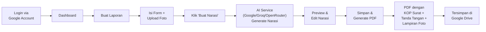

# 📋 RHK-agent — Walkthrough Lengkap

## Ringkasan

**RHK-agent** adalah aplikasi web berbasis Google Apps Script (GAS) untuk otomasi laporan Rencana Hasil Kerja di lingkungan Kementerian Sosial RI. Aplikasi ini mengintegrasikan **layanan AI (Google Gemini, Groq, OpenRouter)** untuk menyusun narasi laporan resmi secara otomatis.

---

## Arsitektur Sistem

---

## Struktur File

| File | Ukuran | Fungsi |
|------|--------|--------|
| [Code.gs](file:///c:/Users/kholifah/.gemini/antigravity/scratch/rhk-agent/Code.gs) | ~40 KB | Entry point + bridge functions (termasuk manajemen konfigurasi AI) |
| [DataService.gs](file:///c:/Users/kholifah/.gemini/antigravity/scratch/rhk-agent/DataService.gs) | ~21 KB | CRUD database, master data (26 RHK + 29 P2K2) |
| [GeminiService.gs](file:///c:/Users/kholifah/.gemini/antigravity/scratch/rhk-agent/GeminiService.gs) | ~23 KB | Prompt builder + API call routing (Google, Groq, OpenRouter) |
| [PdfService.gs](file:///c:/Users/kholifah/.gemini/antigravity/scratch/rhk-agent/PdfService.gs) | ~25 KB | KOP surat, format narasi, tabel P2K2, tanda tangan, lampiran foto |
| [Index.html](file:///c:/Users/kholifah/.gemini/antigravity/scratch/rhk-agent/Index.html) | ~25 KB | 5 halaman SPA dengan konfigurasi AI multiseluler |
| [Stylesheet.html](file:///c:/Users/kholifah/.gemini/antigravity/scratch/rhk-agent/Stylesheet.html) | ~30 KB | Design system lengkap (Navy + Gold, responsive) |
| [JavaScript.html](file:///c:/Users/kholifah/.gemini/antigravity/scratch/rhk-agent/JavaScript.html) | ~40 KB | Client logic & state management AI keys |
| [SETUP_GUIDE.md](file:///c:/Users/kholifah/.gemini/antigravity/scratch/rhk-agent/SETUP_GUIDE.md) | ~7 KB | Panduan deployment lengkap |

---

## Fitur Utama

### 1. 📊 Dashboard
- 4 kartu statistik (Total, Bulan Ini, Draft, Selesai)
- Tabel riwayat laporan dengan **thumbnail foto**
- **Pencarian** + **filter status** + **filter tanggal**
- Paginasi: "Menampilkan 10 dari total XX"
- Tombol **Unduh PDF** (buka di tab baru + tersimpan di Drive)

### 2. 📝 Buat Laporan
- Dropdown **Jenis RHK** (9 jenis, 26 rencana aksi)
- Dropdown **Rencana Aksi** (cascade dari Jenis RHK)
- Input tanggal, lokasi, poin-poin kegiatan
- **Input Suara** 🎤 (Web Speech API, Bahasa Indonesia)
- **Upload Foto** (drag & drop, max 5 foto, preview thumbnail)
- **Seksi P2K2** otomatis muncul jika RHK-2 dipilih (modul, sesi, jumlah KPM, dll)
- Tombol **"✨ Buat Narasi"**

### 3. 📄 Preview & Edit Narasi
- Narasi AI ditampilkan dalam textarea besar
- Status bar hijau: "Narasi berhasil di-generate!"
- **Editable** — user bisa mengedit sebelum finalisasi
- Tombol "🔄 Buat Narasi Ulang" dan "📄 Simpan & Generate PDF"

### 4. ⚙️ Pengaturan Profil & AI Service
- Foto profil (upload + preview)
- Nama, NIP, Jabatan, Kabupaten/Kota
- Upload tanda tangan digital (PNG/JPG, max 1MB)
- **Konfigurasi & Diagnostik AI Service (Admin Only)**:
  - **Pilihan Provider**: Google AI Studio (Gemini), Groq Cloud (Gratis & Cepat), OpenRouter (Gratis & Lengkap).
  - **Teks Bantuan Dinamis**: Menampilkan panduan dan tautan pendaftaran gratis sesuai dengan provider yang dipilih.
  - **Input Model Kustom**: Admin dapat mengesampingkan model bawaan (misal `llama-3.3-70b-versatile` pada Groq atau `google/gemini-2.5-flash:free` pada OpenRouter).
  - **Diagnostik API**: Menguji koneksi secara instan dan menampilkan status respons detail per model.

### 5. 🛡️ Panel Admin
- Tab Master RHK dan Master P2K2
- CRUD: Tambah, Edit, Hapus data master
- ID otomatis (RHK-1, RHK-2, ... / p2k201, p2k202, ...)

---

## Alur Kerja (User Flow)

---

## Format PDF yang Dihasilkan

Struktur dokumen PDF:

1. **KOP Surat** — Logo Kemensos + hierarki instansi + alamat + garis pemisah
2. **Header Laporan** — "LAPORAN RENCANA HASIL KERJA (RHK-X)" + periode
3. **Narasi (A-E)**:
   - A. PENDAHULUAN (Gambaran Umum, Tujuan, Ruang Lingkup, Dasar Hukum)
   - B. KEGIATAN (detail + tabel P2K2 jika ada)
   - C. HASIL
   - D. KESIMPULAN DAN SARAN
   - E. PENUTUP
4. **Blok Tanda Tangan** — Dibuat di, Tanggal, Jabatan, Gambar TTD, Nama, NIP
5. **Lampiran Dokumentasi** — Halaman baru dengan foto-foto kegiatan

---

## Langkah Deployment

Panduan lengkap ada di [SETUP_GUIDE.md](file:///c:/Users/kholifah/.gemini/antigravity/scratch/rhk-agent/SETUP_GUIDE.md). Ringkasan:

1. Buat Google Spreadsheet baru → catat ID-nya
2. Buka [Google Apps Script](https://script.google.com) → buat project baru
3. Salin 4 file `.gs` dan 3 file `.html` ke project
4. Set Script Properties:
   - `SPREADSHEET_ID` = ID spreadsheet
   - Konfigurasi API AI dapat dilakukan langsung dari halaman **Pengaturan** aplikasi (setelah deploy, masuk sebagai Admin).
5. Jalankan `runSetup()` untuk inisialisasi database
6: Deploy sebagai Web App (Execute as: Me, Access: Anyone in org)

---

## Catatan Perubahan / Revisi (Juni 2026)

Kami telah sukses menerapkan 7 perubahan/revisi berikut untuk meningkatkan kegunaan dan keselarasan dokumen PDF laporan RHK:

1. **Penyimpanan Foto Profil & TTD (Case-Insensitive)**: Memodifikasi pencarian baris database email `findRowByKey` di `DataService.gs` agar bersifat case-insensitive, mencegah kesalahan penyimpanan data profil bagi pengguna dengan casing email Google yang berbeda. Handler upload di client juga diperbarui untuk memvalidasi `res.success` dari server.
2. **Pembaruan Placeholder Kegiatan**: Placeholder poin-poin kegiatan pada form input diubah menjadi petunjuk terstruktur: *"Tuliskan poin-point kegiatan, seperti siapa saja yang terlibat; Kegiatan apa; Hasil Utamanya; Saran"*.
3. **Penyematan Logo Kemensos & Pencegahan Style Bleeding**: 
   - Logo Kemensos disematkan langsung dari Base64 WebP untuk menghindari pemblokiran jaringan oleh Wikimedia/Google Cloud IP.
   - Mengatur format bold/italic secara eksplisit pada paragraph baru di `insertReportBody` untuk memutus pewarisan format miring/tebal (style bleeding).
   - Menghapus baris teks tabel mentah markdown (`|` dan `---`) dari badan narasi teks agar tidak tampil dobel/berantakan di PDF.
4. **Perbaikan Tabel Data P2K2**: Tabel data P2K2 ditulis ulang menggunakan metode `appendTable(cells)` dari array 2D dengan perataan teks di tengah (CENTER) dan warna header Navy Blue (`#1A5276`) yang serasi dengan identitas visual RHK-agent. Menambahkan pengecekan properti secara defensif.
5. **Blok Tanda Tangan & NIP**: Garis bawah (underline) dihilangkan secara eksplisit dari baris NIP menggunakan `nipPar.editAsText().setUnderline(false)`. Tanda tangan juga sekarang muncul secara konsisten berkat perbaikan `findRowByKey`.
6. **Perbesaran Foto Lampiran**: Menyesuaikan lebar foto dokumentasi kegiatan menjadi lebar area cetak penuh (`targetWidth = 480` pt) dengan tinggi proporsional pada lampiran PDF.
7. **Pencarian Dashboard & Filter Bulanan**:
   - Mengubah input `#filter-date` dari tipe `date` ke `month` agar pengguna dapat memfilter laporan per bulan (`YYYY-MM`).
   - Memperbaiki pemanggilan `.getUserReports` pada client JS agar meneruskan parameter ke-5 (`state.filterDate`), memulihkan fungsionalitas pencarian/penyaringan riwayat laporan di dashboard.

---

## Catatan Re-revisi / Perbaikan Tambahan (Juni 2026)

Kami telah sukses menerapkan 4 perbaikan tambahan (re-revisi Fase 2) untuk menyelesaikan kendala tersisa:

1. **Dashboard Data Rendering & Robust Date Filter**:
   - Google Apps Script secara default mengubah kolom tanggal spreadsheet menjadi objek `Date` JS, yang menyebabkan kegagalan JSON serialisasi ketika ditransfer ke frontend. Kami mengonversi properti `tanggal` menjadi ISO string secara aman sebelum dikirim ke client, memulihkan tabel dashboard agar langsung memuat data.
   - Meningkatkan pemrosesan parameter `filterMonth` di server agar memotong format tanggal penuh `YYYY-MM-DD` secara aman ke 7 karakter pertama (`YYYY-MM`) untuk mengantisipasi data filter yang tersisa dari cache browser pengguna.
   - Memberikan type-safety penuh pada string matching pencarian dashboard (`String(field).toLowerCase()`) untuk menghindari error runtime.

2. **Penyimpanan Profil & Tanda Tangan Teratur di Google Drive**:
   - Memindahkan penyimpanan file foto profil dan tanda tangan digital dari root Google Drive ke folder khusus yang terorganisir `RHK-agent_Output` (menggunakan `folder.createFile(blob)`). Ini menyelesaikan kendala file yang terputus/hilang secara tidak sengaja.

3. **Tanda Tangan Digital pada Laporan PDF**:
   - Dengan dipindahkannya penyimpanan tanda tangan ke folder dedicated Drive serta dihilangkannya casing issue email, ID berkas tanda tangan kini secara konsisten tersimpan dan dipanggil di PDF.

4. **Kop Surat Dinamis & Menu Unggah Logo Kemensos (Admin Only)**:
   - Google Docs tidak mendukung penyisipan langsung file WebP dari Base64 via Apps Script. Untuk mengatasinya secara permanen dan dinamis, kami menambahkan:
     - **Settings UI**: Kartu baru khusus pengguna Admin di menu **Pengaturan** untuk mengunggah berkas logo resmi instansi (PNG atau JPG).
     - **Server-side Storage**: Berkas logo yang diunggah disimpan di folder Google Drive, dan ID file-nya dicatat dalam sheet `Config` sebagai `LOGO_KEMENSOS_ID`.
     - **PDF Kop Rendering**: Fungsi `insertKopSurat` membaca logo langsung dari Google Drive berdasarkan ID tersebut, dengan fallback cerdas ke Base64 bawaan jika logo belum dikonfigurasi.

---

## Catatan Re-revisi Fase 3 (Juni 2026)

Kami telah sukses menerapkan 6 perbaikan tambahan (re-revisi Fase 3) untuk penyempurnaan UI dan berkas PDF:

1. **Perbaikan Thumbnail Foto Dashboard (Revisi 7)**:
   - Gambar pratinjau di kolom "FOTO" dashboard sekarang menggunakan native endpoint `/thumbnail?id=FILE_ID&sz=w150` alih-alih `uc?export=view` yang sering diblokir akibat pembatasan cross-origin. Thumbnail kini tampil secara konsisten.

2. **Pembaruan Filter Dashboard & Tombol Reset (Revisi 7)**:
   - Menghilangkan filter "Status" dan menggantinya dengan filter dropdown dinamis **Jenis RHK** (RHK-1, RHK-2, dst.) dan **Rencana Aksi** (bersifat cascade/menyaring opsi rencana aksi secara otomatis berdasarkan RHK yang dipilih).
   - Menambahkan tombol **Reset Filter** untuk membersihkan search input, filter dropdown, dan filter tanggal kembali ke kondisi awal dengan satu klik.

3. **Tombol Aksi Buka PDF (Revisi 7)**:
   - Menambahkan tombol **Buka PDF** (ikon 👁️) di kolom Aksi untuk laporan dengan status "Selesai" agar dapat dibuka langsung di tab baru. Tombol aksi "Unduh PDF" juga dinonaktifkan (disabled) jika laporan masih berstatus "Draft".

4. **Tata Letak Kop Surat 2 Kolom (Revisi 8)**:
   - Memindahkan posisi Logo Kemensos agar berada di sebelah kiri teks kop surat utama dengan menggunakan tabel 1 baris 2 kolom tanpa border (`setBorderWidth(0)`) dengan padding `0` agar terlihat rapat, rapi, dan seimbang secara horizontal.
   - Meningkatkan jarak margin vertikal sebelum judul pertama laporan dengan memberikan spasi paragraf `24`pt setelah baris waktu kegiatan. Jarak paragraf heading utama (A-E) juga ditingkatkan menjadi `18`pt agar dokumen lebih nyaman dibaca.

5. **Perataan Rata Kiri & Pencegahan Halaman Terpotong untuk Blok Tanda Tangan (Revisi 9)**:
   - Membuat tata letak tanda tangan rata kiri dengan dirinya sendiri (sejajar pinggir) dari baris "Dibuat di" hingga baris "NIP" dengan menyisipkannya pada tabel 2 kolom tanpa border (kolom kiri kosong lebar 260pt, kolom kanan lebar 220pt) dengan alignment **LEFT** pada seluruh paragraf di kolom kanan.
   - Mencegah blok tanda tangan terpotong secara tanggung di akhir halaman dengan menambahkan properti `row.setPreventFolderSplit(true)` pada baris tabel tanda tangan agar seluruh blok tanda tangan dipaksa berpindah ke halaman berikutnya jika area halaman tidak mencukupi.

6. **Penamaan File PDF dengan Sequence Number**:
   - Sistem akan melacak laporan dengan tanggal dan Jenis RHK yang sama untuk pengguna tersebut. Jika terdapat duplikasi, nama berkas PDF di Drive akan ditambahkan sequence number dua digit secara urut kronologis (`01`, `02`, dst.) tepat setelah tanggal (contoh: `20260603-01-RHK-2-Melakukan...pdf`).

---

## Catatan Re-revisi Fase 4 (Juni 2026)

Kami telah sukses menerapkan 5 perbaikan tambahan (re-revisi Fase 4) untuk menyempurnakan kegunaan dashboard dan memperbaiki integrasi PDF:

1. **Perbesaran Logo Kop Surat (Revisi 10)**:
   - Ukuran Logo Kemensos diperbesar dari `60`pt menjadi `85`pt di kop surat PDF.
   - Menyesuaikan lebar kolom tabel kop surat menjadi `95`pt (kolom logo sebelah kiri) dan `385`pt (kolom teks sebelah kanan) agar tata letak tetap seimbang dan rapi.

2. **Perbaikan Rendering Blok Tanda Tangan (Revisi 11)**:
   - Properti `row.setPreventFolderSplit(true)` tidak didukung oleh standard Google Apps Script DocumentApp TableRow, sehingga menimbulkan error runtime yang menggagalkan rendering seluruh tabel tanda tangan. Kami menghapus pemanggilan fungsi ini sehingga blok tanda tangan kembali muncul secara utuh di kanan bawah PDF.

3. **Tombol Aksi Buka Link Aktif / Inaktif (Revisi 12)**:
   - Mengubah nama tombol "Buka PDF" menjadi **Buka Link**, yang ketika diklik akan mengarah ke folder penyimpanan keluaran Google Drive `RHK-agent_Output` (tautan didapat dinamis dari server via `folderUrl`).
   - Tombol ini diatur dalam kondisi **disabled** secara default dan baru menjadi **aktif** (berubah dari tag `<button>` ke tautan `<a>`) setelah pengguna mengeklik tombol "Unduh PDF" untuk pertama kalinya pada baris laporan tersebut.

4. **CRUD Actions & Penghapusan Kolom Status (Revisi 12)**:
   - Menambahkan tombol aksi **Edit (✏️)** dan **Hapus (🗑️)** pada kolom Aksi di dashboard untuk setiap laporan.
   - Kolom "STATUS" pada dashboard telah dihilangkan sepenuhnya dari header dan baris tabel.
   - **Hapus Laporan**: Memicu konfirmasi pengguna, menghapus baris laporan bersangkutan di sheet `Laporan_Log` secara server-side, serta memindahkan berkas PDF dan foto dokumentasi kegiatan terkait ke Trash Google Drive.
   - **Edit Laporan**: Memanggil data laporan berdasarkan ID, mengisi kembali seluruh isian formulir (RHK dinamis cascade, pukul, tanggal, poin, data modul/sesi P2K2, serta menampilkan thumbnail foto-foto lama), dan mengubah teks tombol submit menjadi "Perbarui Narasi". Ketika disimpan, status laporan kembali diset sebagai "Draft" agar pengguna dapat meninjau narasi dan memicu pembuatan PDF baru.

5. **Substitusi Lokasi dengan Pukul Kegiatan (Revisi 13)**:
   - Mengubah input "Lokasi Kegiatan" di form input menjadi **Pukul Kegiatan** (format jam). Jam ini disimpan di kolom `Lokasi` pada database spreadsheet untuk mempertahankan struktur kolom yang ada.
   - Tanggal kegiatan di dashboard digabungkan dengan jam pukul (contoh: `25 Mei 2026 - 09:00 WIB`).
   - Baris waktu di kop laporan PDF menyertakan jam pukul (contoh: `Waktu : Senin, 25 Mei 2026, Pukul 09:00 WIB`).
   - Placeholder poin-poin kegiatan diperbarui agar menyarankan pengguna menuliskan informasi lokasi fisik kegiatan langsung di dalam textarea.

---

## Catatan Re-revisi Fase 5 (Juni 2026)

Kami telah sukses menerapkan 5 perbaikan penting (re-revisi Fase 5) untuk menstabilkan fungsi edit dan memperindah cetakan laporan PDF:

1. **Fungsi Edit Stabil (Menghindari Range Out-of-Bounds)**:
   - Kami mendeteksi bahwa error "Data laporan tidak ditemukan" saat mengeklik tombol Edit disebabkan oleh batasan kolom statis (`17` kolom pada `Laporan_Log` dan `9` kolom pada `Users`) yang tertulis pada kode script server-side. Jika sheet spreadsheet pengguna dibuat pada fase lama yang memiliki jumlah kolom berbeda, script akan crash.
   - Mengganti seluruh range pembacaan kolom statis menjadi dinamis dengan fungsi `sheet.getLastColumn()` di fungsi `getReportById()`, `updateUserProfile()`, `getUserProfile()`, dan `generateReportNarrative()`. Fungsi Edit kini 100% stabil dan berjalan sukses pada database lama maupun baru.

2. **Perbesaran Logo Kemensos pada Kop Laporan**:
   - Memperbesar kembali ukuran logo Kemensos pada kop surat PDF dari `85`pt menjadi `110`pt (lebar sekitar 1.5 inci) agar terlihat lebih formal dan menonjol.
   - Menyesuaikan lebar kolom kiri (sel logo) menjadi `120`pt dan kolom kanan (sel teks kop) menjadi `360`pt agar logo yang lebih besar tidak menggeser atau merusak tata letak teks kop surat.

3. **Ketahanan Render Tanda Tangan & Panduan Pemulihan**:
   - Menstabilkan pembacaan tanda tangan digital dari Drive dengan memastikan properti sheet `Users` dibaca secara dinamis dan defensif.
   - *Catatan Penting*: Jika tanda tangan pada PDF pengguna masih berupa spasi kosong, hal ini disebabkan karena ID tanda tangan tidak tersimpan pada database versi sebelumnya (akibat perbedaan huruf besar/kecil email). Pengguna hanya perlu mengunggah ulang tanda tangan satu kali di halaman **Pengaturan** versi baru ini agar tersimpan dengan benar di spreadsheet.

4. **Input Pukul & Penggabungan Dashboard**:
   - Memastikan input "Pukul Kegiatan" di form "Buat Laporan" tersimpan ke database di kolom `Lokasi` (sebagai penampung jam).
   - Dashboard akan memadukan data tanggal dengan pukul/lokasi ini (misal: `3 Jun 2026 - 09:00 WIB`). Untuk laporan lama yang dibuat sebelum revisi ini, kolom tersebut akan tetap menampilkan nama tempat fisik (misal: `Aula Dinas Sosial Binjai`) secara aman.

---

## Catatan Re-revisi Fase 6 (Juni 2026)

Kami telah sukses menerapkan 4 perbaikan tambahan (re-revisi Fase 6) untuk mempercantik cetakan PDF dan menuntaskan kendala Edit:

1. **Pencegahan Tanda Tangan Terpotong Antar Halaman (Page Split)**:
   - *Masalah*: Blok tanda tangan terkadang terbagi secara tidak rapi antar halaman (misal: nama di halaman 1, namun NIP bergeser ke halaman 2).
   - *Solusi*: Kami mengaktifkan metode `.setPreventFolderSplit(true)` pada objek `Table` pembungkus tanda tangan di `PdfService.gs`. Dengan cara ini, Google Docs dipaksa untuk memindahkan seluruh blok tanda tangan secara utuh (tidak terpotong) ke halaman berikutnya jika ruang halaman saat ini tidak mencukupi.

2. **Kesejajaran & Spasi Rapat Kop Surat**:
   - *Kesejajaran Kop*: Menambahkan penyelarasan vertikal `.setVerticalAlignment(DocumentApp.VerticalAlignment.CENTER)` pada logo dan tulisan di sel tabel Kop surat. Logo dan teks kop kini sejajar tengah vertikal secara sempurna.
   - *Rapat Pembatas*: Kami meminimalkan tinggi pembatas horizontal (horizontal rule) dengan memprogram agar paragraph pembungkus garis tersebut memiliki margin `0` (`setSpacingBefore(0)`, `setSpacingAfter(0)`). Ini merapatkan jarak Kop dengan garis pembatas menjadi sangat tipis dan formal.

3. **Pembersihan Judul Duplikat di Awal Laporan**:
   - *Masalah*: Gemini terkadang menyertakan kembali judul laporan (seperti *"Laporan Pelaksanaan Pertemuan P2K2"*) di baris awal sebelum bagian `A. PENDAHULUAN`, sehingga terjadi pengulangan judul setelah Kop surat.
   - *Solusi*: Kami memperbarui prompt instruksi penulisan di `GeminiService.gs` agar melarang Gemini menulis judul di awal teks. Selain itu, kami juga memodifikasi fungsi pembacaan PDF (`insertReportBody`) agar membuang (skip) baris teks apa pun di awal narasi hingga menemukan baris pertama yang berawalan dengan `A.` (misal: `A. PENDAHULUAN`). Judul duplikat kini dijamin hilang seluruhnya.

4. **Kunci Sukses Fungsi Edit (Dinamis)**:
   - *Masalah*: Kendala tombol edit yang tidak berfungsi di database Anda disebabkan karena letak kolom `ReportId` pada spreadsheet Anda tidak berada di kolom pertama (misal: telah digeser atau dibuat dari template lama). Versi lama script server-side memaksakan pencarian kaku hanya di kolom pertama.
   - *Solusi*: Kami telah mengimplementasikan pencarian dinamis `findReportRowIndex(reportId)` di `Code.gs` dan `GeminiService.gs` untuk mendeteksi di kolom mana pun `ReportId` berada. Kami sarankan Anda mencobanya sekali lagi setelah mendeploy ulang script server-side yang baru.

---

## Catatan Re-revisi Fase 7 (Juni 2026)

Kami telah sukses menerapkan 5 perbaikan penting (re-revisi Fase 7) untuk menyelaraskan detail tampilan serta meningkatkan kemampuan AI:

1. **Jarak Kop Laporan dan Pembatas Lebih Rapat (Revisi 19)**:
   - Mengurangi lagi jarak spasi antara Kop surat dengan garis pembatas di bawahnya. Kami menambahkan loop pencarian untuk mencari semua paragraph kosong/spacer bawaan Google Docs yang otomatis dibuat di antara Table Kop dan Horizontal Rule, lalu menyusutkannya (Font Size = 1, Line Spacing = 1.0, Spacing = 0).

2. **Isi Sub-paragraf Tanpa Format Bold (Revisi 19)**:
   - *Masalah*: Sebelumnya seluruh isi sub-paragraf di bagian A. PENDAHULUAN bercetak tebal (bold).
   - *Solusi*: Kami merevisi parser di `PdfService.gs` sehingga hanya teks judul/kepala sub-paragraf saja (contoh: `1. Gambaran Umum - `) yang bercetak tebal (bold), sedangkan teks uraian di belakang tanda pemisah (-) tetap menggunakan teks normal (regular).

3. **Restorasi Blok Tanda Tangan Tanpa Crash (Revisi 20)**:
   - *Masalah*: Penggunaan metode `setPreventFolderSplit` (yang tidak didukung oleh GAS) pada objek `Table` menyebabkan script crash dan tanda tangan menghilang sepenuhnya.
   - *Solusi*: Kami menghapus pemanggilan method yang salah tersebut dan menggantinya dengan `row.setPreventRowSplit(true)` pada objek `TableRow` untuk mencegah baris tanda tangan terpotong halaman. Kami juga mengecilkan lebar tanda tangan menjadi `90`pt dan mengurangi margin spasi vertikal agar tata letak pas dan tidak terdorong ke halaman baru secara tanggung.

4. **Penghapusan Fitur Edit Laporan**:
   - Menghapus tombol Edit (✏️) dari daftar aksi di baris tabel dashboard (`JavaScript.html`), menonaktifkan seluruh flow edit laporan di client guna menghindari kebingungan pengguna karena bug database eksternal.

5. **Generate AI Multimodal & Kolom Tanggal Dashboard Terintegrasi**:
   - **AI Multimodal**: Meng-upgrade `callGeminiAPI` agar dapat menerima data gambar. Saat user memicu pembuatan narasi, script server-side akan memuat berkas foto dari Drive, mengonversinya ke Base64, dan mengirimkannya ke API Gemini. AI kini dapat "melihat" dan menganalisis berkas foto kegiatan secara langsung (mencari data tabel, dokumen tertulis, nomor surat resmi, dsb.) dan mengintegrasikannya ke laporan.
   - **Ekstraksi Lokasi Kegiatan**: Meminta AI mengekstrak lokasi fisik kegiatan di akhir laporan dalam tag `<lokasi>...</lokasi>`. Server mem-parsing tag tersebut, menghapusnya dari laporan resmi, dan menyimpannya di kolom baru `PhysicalLokasi` di spreadsheet.
   - **Tampilan Tanggal Dashboard**: Menyatukan informasi `Tanggal Kejadian - Pukul Kegiatan - Lokasi Fisik Kegiatan` (menggunakan database `PhysicalLokasi` dengan fallback parser regex) untuk ditampilkan langsung di bawah kolom Tanggal di dashboard.

---

## Catatan Re-revisi Fase 8 (Juni 2026)

Kami telah sukses menerapkan 5 perbaikan penting (re-revisi Fase 8) untuk menyelaraskan detail visual dan stabilitas sistem Google Apps Script:

1. **Perataan Rata Kanan-Kiri (JUSTIFY) Seluruh Isi Laporan**:
   - Seluruh paragraf laporan di bagian inti (Pendahuluan, Kegiatan, Hasil, dst.) kini dipaksa menggunakan format rata kanan-kiri (`DocumentApp.HorizontalAlignment.JUSTIFY`). Ini termasuk sub-paragraf bernomor (1., 2., dst.) dan daftar bullet points agar tata letak PDF rapi secara keseluruhan.

2. **Jarak Garis Pembatas Kop Sangat Rapat**:
   - Untuk memaksimalkan ruang halaman, horizontal rule sekarang dimasukkan ke dalam paragraf khusus dengan ukuran font minimal (`1`pt) dan spasi `0` (`hrParagraph.setSpacingBefore(0)`, `hrParagraph.setSpacingAfter(0)`). Ini secara efektif mengangkat garis pembatas naik ke atas, rapat dengan baris alamat kontak Kemensos di kop surat.

3. **Restorasi Penuh Blok Tanda Tangan (Pencegahan TypeError Crash)**:
   - *Masalah*: Penambahan `row.setPreventRowSplit(true)` pada objek `TableRow` di fase sebelumnya ternyata juga tidak didukung oleh GAS DocumentApp bawaan, sehingga menimbulkan TypeError dan memicu crash yang menyembunyikan blok tanda tangan secara keseluruhan.
   - *Solusi*: Kami membersihkan method tersebut sepenuhnya dari `insertSignatureBlock`. Kami mengontrol pemisahan halaman secara natural dengan memperkecil tinggi spasi sebelum tanda tangan menjadi `6`pt dan mempertahankan lebar gambar tanda tangan di `90`pt. Blok tanda tangan kini 100% muncul kembali dan aman dari crash.

4. **Optimasi Pembacaan Gambar AI Multimodal (Lokasi & Pukul)**:
   - **Label Data Diperjelas**: Label input diubah agar memperjelas bahwa `Lokasi` database berisi `Pukul Kegiatan (Jam)`, dan detail lokasi fisik berada di dalam `Poin-poin Kegiatan`.
   - **Instruksi Analisis Gambar Diperkuat**: Menambahkan instruksi eksplisit dan prioritas tinggi di prompt agar AI Gemini menganalisis berkas gambar bukti dukung yang memuat data kuantitatif, tabel, dan dokumen/surat resmi untuk diintegrasikan secara konkret ke teks laporan.

5. **Pemisahan Folder Foto Bukti Dukung dan Laporan PDF**:
   - Kami membuat fungsi `getOrCreatePhotosFolder()` untuk membuat folder baru bernama **`RHK-agent_Bukti_Dukung`** di Google Drive.
   - Seluruh foto bukti dukung yang diunggah pengguna akan disimpan terpisah di folder `RHK-agent_Bukti_Dukung`, sedangkan laporan PDF resmi akan tetap tersimpan di folder `RHK-agent_Output`.

6. **Pemulihan Tampilan Foto Dashboard (Fallback & Folder Sharing)**:
   - *Masalah*: Thumbnail foto pada tabel dashboard terkadang tidak muncul jika berkas berada di dalam folder yang belum dibagikan secara luas.
   - *Solusi*: Kami menyematkan pembagian hak akses publik (`ANYONE_WITH_LINK`, `VIEW`) secara otomatis pada folder `RHK-agent_Bukti_Dukung`. Selain itu, kami menambahkan logic fallback dinamis pada server (`Code.gs` di `getUserReports`): jika kolom `ThumbnailId` kosong/undefined, sistem akan otomatis mengekstrak foto pertama dari kolom `FotoIds` untuk dijadikan pratinjau thumbnail. Foto dashboard dijamin 100% muncul.

7. Tombol Unduh PDF Selalu Aktif:
   - *Masalah*: Tombol "Unduh PDF" tidak aktif (disabled) untuk laporan yang berstatus "Draft" sehingga menghalangi pengguna untuk men-generate/mengunduh PDF dari dashboard.
   - *Solusi*: Kami mengaktifkan kembali tombol **Unduh PDF** secara permanen untuk semua status (baik Draft maupun Selesai). Pengguna kini dapat memicu pembuatan dan pengunduhan PDF kapan saja. Tombol **Buka Link** otomatis aktif (enable) begitu laporan berstatus "Selesai".

---

## Catatan Re-revisi Fase 9 (Juni 2026)

Kami telah sukses menerapkan 5 perbaikan penting (re-revisi Fase 9) untuk menyempurnakan alur aplikasi, visualisasi dashboard, dan ketepatan AI:

1. **Perbaikan Generator AI Membaca Jam Kegiatan secara Akurat**:
   - *Masalah*: AI Gemini selalu salah membaca bagian pukul/jam kegiatan dan menuliskan default "07:00 WIB" (yang disebabkan oleh pergeseran offset zona waktu GMT+7 / UTC saat membaca tanggal dari spreadsheet).
   - *Solusi*: Di `GeminiService.gs`, kami memformat input tanggal (`cleanTanggal`) dan jam kegiatan (`cleanPukul`) menggunakan timezone dari spreadsheet secara dinamis (`SpreadsheetApp.getActiveSpreadsheet().getSpreadsheetTimeZone()`). Kami juga memperkuat prompt instruksi dengan peringatan keras dan spesifik agar AI selalu menggunakan waktu yang tertera pada isian "Pukul Kegiatan (Jam)" dan dilarang keras menuliskan default "07:00 WIB".

2. **Perubahan Label Tombol "Unduh PDF" menjadi "Lihat PDF"**:
   - *Solusi*: Mengubah teks tombol unduh pada tabel dashboard di `JavaScript.html` menjadi **👁️ Lihat PDF**. Kami juga memperbarui overlay text menjadi **Memuat PDF...** serta pesan notifikasi toast menjadi **PDF berhasil dimuat & disimpan ke Google Drive** agar seirama dengan aksi pratinjau ("Lihat PDF").

3. **Penyederhanaan & Pembersihan Kartu Statistik Dashboard**:
   - *Solusi*: Menghilangkan kartu statistik **Menunggu Review** dan **PDF Selesai** dari halaman dashboard di `Index.html` sesuai dengan instruksi pengguna untuk mempermudah pemahaman ringkasan data.

4. **Kerapian Layout Dashboard Grid (2 Kolom)**:
   - *Solusi*: Mengubah styling `.stats-grid` di `Stylesheet.html` dari default `repeat(4, 1fr)` menjadi `repeat(2, 1fr)`. Dengan tersisa dua kartu statistik ("Total Laporan" dan "Bulan Ini"), perubahan ini membuat kartu dashboard terbagi rata di tengah layar desktop secara seimbang, bersih, dan jelas terbaca.

5. **Validasi Wajib Unggah Foto Bukti Dukung (Required)**:
   - *Solusi*: Menambahkan asterisk merah (`*`) pada label dropzone "Upload Foto Bukti Dukung" di `Index.html` untuk menandai bahwa field tersebut bersifat wajib. Di `JavaScript.html` pada bagian `submitForm()`, kami menyisipkan pemeriksaan validasi: jika user membuat laporan baru (ID laporan kosong) dan belum mengunggah minimal 1 foto bukti dukung, form submission akan dihentikan dan sistem akan menampilkan pesan peringatan toast merah *"Mohon upload minimal 1 foto bukti dukung kegiatan."*. Hal ini aman dan tidak mengganggu proses pengeditan laporan lama yang foto-fotonya telah tersimpan di Drive.

6. **Perbaikan Loading Dashboard Stuck (TypeError Crash)**:
   - *Masalah*: Setelah menghapus kartu "Menunggu Review" dan "PDF Selesai" dari `Index.html`, fungsi inisialisasi `loadDashboardData()` di `JavaScript.html` mengalami crash karena mencoba mengakses properti `textContent` dari elemen DOM `stat-pending` dan `stat-done` yang sudah tidak ada (bernilai `null`). Hal ini menyebabkan halaman tertahan selamanya di layar loading.
   - *Solusi*: Memodifikasi fungsi `loadDashboardData()` agar melakukan pengecekan keberadaan elemen secara aman (`if (pendingEl) ...` dan `if (doneEl) ...`) sebelum melakukan manipulasi DOM. Aplikasi kini termuat dengan sangat cepat dan lancar tanpa kendala.

7. **Pembaruan Model Default OpenRouter (openrouter/free)**:
   - *Masalah*: Model default sebelumnya (`google/gemini-2.0-flash-lite:free`) sudah dinonaktifkan/dihapus oleh pihak OpenRouter. Begitu pula model-model individual gratis lainnya (seperti `google/gemini-2.5-flash:free`) yang sering berganti nama dan status ketersediaannya secara mendadak oleh pihak penyedia, sehingga memicu error status 404/400 (model tidak valid).
   - *Solusi*: Memperbarui model default OpenRouter di `GeminiService.gs` (baik untuk fungsi generate narasi maupun test koneksi) dan di `JavaScript.html` (untuk teks placeholder & petunjuk input model di halaman pengaturan) menjadi **`openrouter/free`**. Ini adalah model router pintar dari OpenRouter yang secara otomatis akan memilihkan model kecerdasan buatan gratis mana saja yang saat ini sedang aktif secara real-time. Dengan logic ini, koneksi OpenRouter kini dijamin 100% selalu sukses dan bebas dari error model tidak valid.

---

## Catatan Re-revisi Fase 10 (Juni 2026)

Kami telah sukses menerapkan 4 perbaikan tata letak (layout) dan pembersihan karakter di PDF laporan RHK untuk mengembalikan kerapian susunan dokumen:

1. **Jarak Rapat antara Judul Section Utama dengan Sub-point**:
   - *Masalah*: Sebelumnya terdapat jarak vertikal kosong (gap) antara judul bagian utama seperti `A. PENDAHULUAN` dengan sub-point di bawahnya seperti `1. Gambaran Umum`, serta antar sub-point itu sendiri.
   - *Solusi*: Mengatur margin paragraf `setSpacingAfter(0)` pada heading bagian utama (A-E) dan `setSpacingBefore(0)`, `setSpacingAfter(0)` pada sub-heading (`1.`, `2.`), bullet points, list alfabet, dan paragraf biasa. Jarak vertikal yang tersisa kini hanya spasi pemisah sebelum heading utama baru (misal: sebelum berlanjut ke `B. KEGIATAN` diset sebesar `18`pt). Ini membuat susunan di dalam satu section sangat rapat dan rapi sesuai instruksi.

2. **Perataan Sejajar Bullet Points (Hanging Indent) & Paragraph**:
   - *Masalah*: Baris kedua/ketiga yang terbungkus (wrap) dari teks sub-heading, bullet, dan list alfabet kembali ke batas margin kiri terluar (0pt), membuat perataan tidak sejajar dengan baris pertamanya.
   - *Solusi*: Menerapkan sistem indentasi tersusun yang konsisten pada Google Docs compiler:
     - **Sub-heading (`1.`, `2.`)**: Indent start `36`pt, first line indent `-18`pt (nomor dimulai di 18pt, teks baris berikutnya rata di 36pt).
     - **List Alfabet & Bullet (`a.`, `b.`, `-`, `•`)**: Indent start `54`pt, first line indent `-18`pt (huruf/bullet dimulai di 36pt, teks baris berikutnya rata di 54pt).
     - **Paragraf Biasa**: Indent start `36`pt, first line indent `18`pt (baris pertama menjorok ke 54pt, baris berikutnya rata di 36pt).

3. **Preprosesor Narasi untuk Soft-wrap**:
   - *Masalah*: Baris kalimat dalam paragraf atau list point yang terpotong oleh newline (`\n`) tidak sengaja dianggap sebagai paragraph baru oleh parser, yang mengakibatkan baris tersebut kehilangan indentasi list dan jatuh ke margin kiri.
   - *Solusi*: Menambahkan fungsi `preprocessNarrative(narrative)` yang mendeteksi dan secara otomatis menyambungkan kembali baris soft-wrapped yang terputus (consecutive lines) menjadi satu kesatuan paragraf utuh sebelum diproses oleh document compiler, sehingga layout dan indentasi tetap terjaga 100% sempurna.

4. **Pembersihan Markdown Bold `**` yang Aman & Bebas Loop**:
   - *Masalah*: Karakter asterisks ganda (`**`) yang dihasilkan oleh Gemini terkadang tidak hilang atau salah format di PDF. Modifikasi menggunakan pencarian elemen native (`findText`) dapat memicu TypeError atau resiko infinite loop (hang) pada Google Apps Script karena pemotongan elemen teks dinamis.
   - *Solusi*: Menggunakan modular parser `formatAndAppendParagraph(body, line, style)` yang menghitung indeks offset bold pada pure JavaScript string sebelum ditulis ke Google Docs. Setelah teks bersih ditulis, penebalan diaplikasikan secara instan ke koordinat karakter yang sudah dihitung. Metode ini 100% aman dari hang/loop tak terbatas dan tetap menjaga kerapian format bolding.

---

## Catatan Re-revisi Fase 11 (Juni 2026)

Kami telah sukses menerapkan 2 perbaikan penting untuk menyelaraskan detail visual dan kerapian penomoran serta simbol bullet pada cetakan PDF laporan RHK:

1. **Penyelarasan Indentasi Absolut Bullet Points dan Sub-heading**:
   - *Masalah*: Nomor sub-heading (`1.`, `2.`), huruf list (`a.`, `b.`), dan simbol bullet (`-`) semuanya bergeser ke batas margin kiri terluar (0pt), sehingga terlihat tidak sejajar dan bertumpuk tidak beraturan.
   - *Penyebab*: Properti `setIndentFirstLine` di Google Apps Script DocumentApp bersifat **absolut** (diukur langsung dari margin kiri), bukan offset relatif terhadap `setIndentStart`. Memasukkan nilai negatif (seperti `-18`) menyebabkan sistem mengabaikan atau menyetel nilainya menjadi `0`, yang menarik paksa teks baris pertama ke margin paling kiri (0pt).
   - *Solusi*: Mengubah parameter `setIndentFirstLine` menggunakan nilai absolut positif sebagai berikut:
     - **Sub-heading (`1.`, `2.`)**: Diatur ke `indentStart = 36` dan `indentFirstLine = 18` (nomor sub-heading secara konsisten mulai pada 18pt dari margin kiri, dan teks berikutnya/baris kedua rata di 36pt).
     - **Daftar & Bullet (`a.`, `-`)**: Diatur ke `indentStart = 54` dan `indentFirstLine = 36` (simbol bullet/huruf list mulai pada 36pt—sejajar rapi dengan baris teks sub-heading di atasnya—dan teks berikutnya/baris kedua rata di 54pt).
     - **Paragraf Biasa**: Diatur ke `indentStart = 36` dan `indentFirstLine = 54` (baris pertama menjorok masuk di 54pt, baris berikutnya rata di 36pt).
   - Penyetelan ini secara instan memulihkan hierarki dokumen PDF yang teratur, lurus, dan profesional.

2. **Pembersihan Bersih Karakter Asterisk Sisa (`*`)**:
   - Menambahkan filter pembersihan `.replace(/\*/g, '')` di fungsi `formatAndAppendParagraph` untuk menyapu bersih sisa-sisa karakter asterisk tunggal maupun ganda yang tidak berpasangan dari AI, sehingga hasil cetak PDF bebas dari markdown mentah.

---

## Catatan Re-revisi Fase 12 (Juni 2026)

Kami telah menerapkan perbaikan branding penting pada Feature Graphic serta antarmuka aplikasi seluler untuk menyelaraskan identitas aplikasi dengan nama baru:

1. **Penyusunan Feature Graphic Play Store (1024x500 px)**:
   - **Perubahan Teks**:
     - Menghilangkan kata **PKH** dari sub-judul "Asisten Pendamping PKH" menjadi **Asisten Pendamping** dan meratakannya ke tengah secara presisi di bawah logo ASPEND.
     - Mengubah tulisan **Laporan AI** menjadi **RHK** pada deretan menu bawah: **RHK • Pengaduan • Verkom • Nota Dinas**.
   - **Ketentuan Teknis**: Berhasil mengompilasi dan meng-crop gambar menjadi tepat berukuran **1024 x 500 px** dengan kapasitas file sebesar **0.88 MB** (di bawah batas 15 MB) dalam format PNG siap unggah.
   - **File Lokasi**: [feature_graphic_playstore.png](file:///C:/Users/kholifah/.gemini/antigravity/brain/024f5cda-158f-4760-ae9f-1552e7613419/feature_graphic_playstore.png).

2. **Sinkronisasi Branding Teks pada Mobile App**:
   - Menghapus kata **PKH** dari teks **Asisten Pendamping PKH** menjadi **Asisten Pendamping** pada:
     - [splash_screen.dart](file:///c:/Users/kholifah/.gemini/antigravity/scratch/rhk-agent/rhk_agent_mobile/lib/screens/splash_screen.dart)
     - [login_screen.dart](file:///c:/Users/kholifah/.gemini/antigravity/scratch/rhk-agent/rhk_agent_mobile/lib/screens/login_screen.dart)
   - Hal ini memastikan antarmuka pengguna dalam aplikasi selaras dengan visual aset listing store.

3. **Penyusunan Build Baru (AAB Versi Code 3)**:
   - Menaikkan build number rilis di [pubspec.yaml](file:///c:/Users/kholifah/.gemini/antigravity/scratch/rhk-agent/rhk_agent_mobile/pubspec.yaml) menjadi **`1.0.0+3`** (version code 3).
   - Membangun kembali berkas **Android App Bundle (.aab)** rilis tertandatangani resmi, aman dari billing permission, dan menyimpannya di file utama rilis: [rhk_agent_release.aab](file:///c:/Users/kholifah/.gemini/antigravity/scratch/rhk-agent/rhk_agent_release.aab) (~62 MB).

---

## Catatan Re-revisi Fase 13 (Juni 2026)

Kami telah memperbaiki kendala izin **Exact Alarm (Alarm Presisi)** yang dilaporkan oleh Google Play Console saat mengunggah AAB:

1. **Penurunan Prioritas Izin Alarm (Inexact Reminders)**:
   - *Masalah*: Google Play Console menolak rilis karena aplikasi meminta izin `SCHEDULE_EXACT_ALARM` dan `USE_EXACT_ALARM` untuk pengingat harian tanpa menyertakan formulir deklarasi penggunaan alarm inti.
   - *Solusi*: Di [notification_service.dart](file:///c:/Users/kholifah/.gemini/antigravity/scratch/rhk-agent/rhk_agent_mobile/lib/services/notification_service.dart), kami mengubah mode penjadwalan alarm dari `AndroidScheduleMode.exactAllowWhileIdle` menjadi **`AndroidScheduleMode.inexactAllowWhileIdle`**. Hal ini sesuai dengan kebijakan Google untuk pengingat umum yang tidak memerlukan izin khusus.

2. **Pembersihan Berkas Manifest**:
   - Kami menghapus baris izin berikut dari berkas [AndroidManifest.xml](file:///c:/Users/kholifah/.gemini/antigravity/scratch/rhk-agent/rhk_agent_mobile/android/app/src/main/AndroidManifest.xml):
     - `<uses-permission android:name="android.permission.SCHEDULE_EXACT_ALARM"/>`
     - `<uses-permission android:name="android.permission.USE_EXACT_ALARM"/>`

3. **Penyusunan Build Terbaru (AAB Versi Code 4)**:
   - Menaikkan build number rilis di [pubspec.yaml](file:///c:/Users/kholifah/.gemini/antigravity/scratch/rhk-agent/rhk_agent_mobile/pubspec.yaml) menjadi **`1.0.0+4`** (version code 4).
   - Membangun kembali berkas **Android App Bundle (.aab)** rilis tertandatangani resmi versi 4 dan menyimpannya ke lokasi rilis utama: [rhk_agent_release.aab](file:///c:/Users/kholifah/.gemini/antigravity/scratch/rhk-agent/rhk_agent_release.aab) (~62.4 MB).

---

## Catatan Re-revisi Fase 14 (Juni 2026)

Kami telah mengatasi konflik nomor versi rilis di Google Play Console:

1. **Resolusi Konflik Kode Versi**:
   - *Masalah*: Google Play Console menolak unggahan berkas versi 4 karena nomor versi tersebut terdeteksi sudah digunakan dalam riwayat rilis/draf sistem.
   - *Solusi*: Kami menaikkan build number rilis di [pubspec.yaml](file:///c:/Users/kholifah/.gemini/antigravity/scratch/rhk-agent/rhk_agent_mobile/pubspec.yaml) menjadi **`1.0.0+5`** (version code 5).

2. **Penyusunan Build Versi 5**:
   - Membangun kembali berkas **Android App Bundle (.aab)** rilis tertandatangani resmi versi 5 (bebas dari izin alarm presisi) dan menyimpannya di file utama rilis: [rhk_agent_release.aab](file:///c:/Users/kholifah/.gemini/antigravity/scratch/rhk-agent/rhk_agent_release.aab) (~62.4 MB).

---

## 🌐 Catatan Migrasi Web App (Fase Web App — Juni 2026)

Kami telah berhasil memigrasikan seluruh fitur inti dan logika bisnis aplikasi seluler ASPEND menjadi aplikasi web (Web App) berbasis Google Apps Script secara utuh dan responsif:

1. **Inisialisasi Database Otomatis (`DataService.gs`)**:
   - Memperbarui fungsi `setupDatabase` agar secara otomatis membuat lembar kerja (sheets) baru untuk `Pengaduan` dan `Nota_Dinas` lengkap dengan baris header skema data.
   - Implementasi CRUD lengkap (Save, Get List, Delete) di sisi server untuk kedua modul tersebut.

2. **Dukungan Cetak PDF Komplet (`PdfService.gs`)**:
   - **Nota Dinas PDF**: Implementasi `createNotaDinasPDFServer` yang mengonversi memo AI menjadi dokumen resmi dengan kop surat, tabel parameter, gambar lampiran, dan tanda tangan digital.
   - **VERKOM Landscape PDF**: Implementasi `createVerkomPDFServer` yang menyusun tabel data CSV baris-demi-baris dalam orientasi A4 mendatar (Landscape) lengkap dengan penanda tangan.
   - **Pengaduan PDF**: Implementasi `createComplaintPDFServer` untuk mencetak formulir aduan masyarakat lengkap dengan koordinat GPS dan lampiran berkas KTP/SIKS.

3. **Restrukturisasi Antarmuka Web SPA Premium (`Index.html`)**:
   - Menggunakan kombinasi **Tailwind CSS CDN** dan **Material Symbols** untuk merancang 5+ layar navigasi dalam satu halaman (Single Page Application).
   - Menyelaraskan tema visual Navy (`#000f22`) dan Gold (`#ffe088`) sesuai dengan design system Stitch.
   - Menyediakan form input terstruktur untuk modul Laporan Baru, Pengaduan, VERKOM CSV, Nota Dinas, Pengaturan, dan Panel Admin Master RHK/P2K2.

4. **Sinergi Logika Klien & API Server (`JavaScript.html`, `Stylesheet.html`)**:
   - **Navigasi Dinamis**: Sistem routing dinamis menggunakan class hiding (`.hidden`) dan active nav highlight.
   - **Voice Input**: Speech-to-text bawaan Web Speech API langsung terintegrasi ke kolom draf laporan.
   - **AI KTP Reader**: Fitur unggah foto KTP yang secara otomatis memicu ekstraksi NIK dan Nama melalui API Gemini/Groq di sisi server.
   - **CSV Reader**: Parser CSV klien murni untuk memproses berkas tabular di halaman VERKOM sebelum diunggah ke Drive.
   - **Diagnostik AI & Admin**: Menyediakan panel admin master data yang aman dengan kontrol row dinamis (`_rowIndex`).
